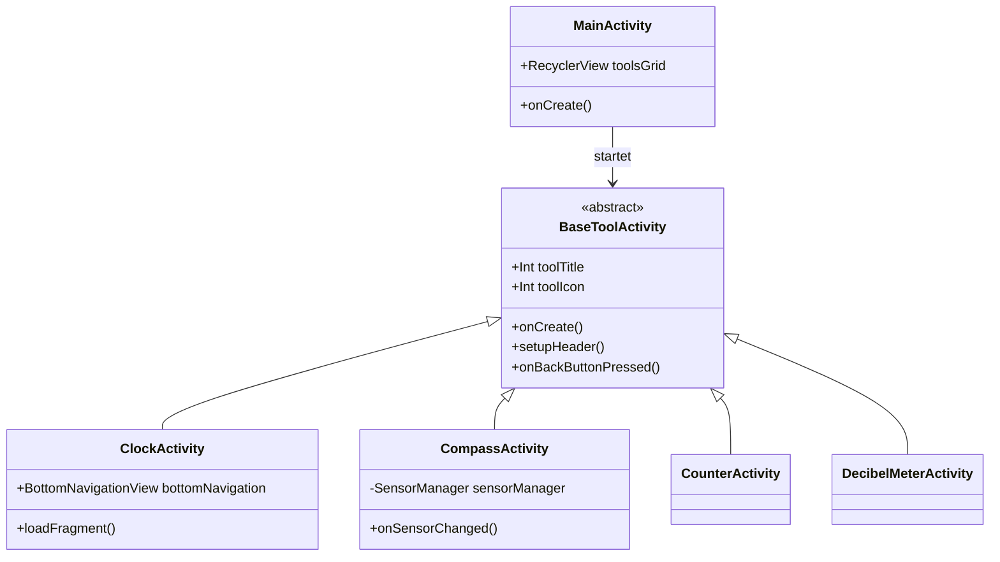
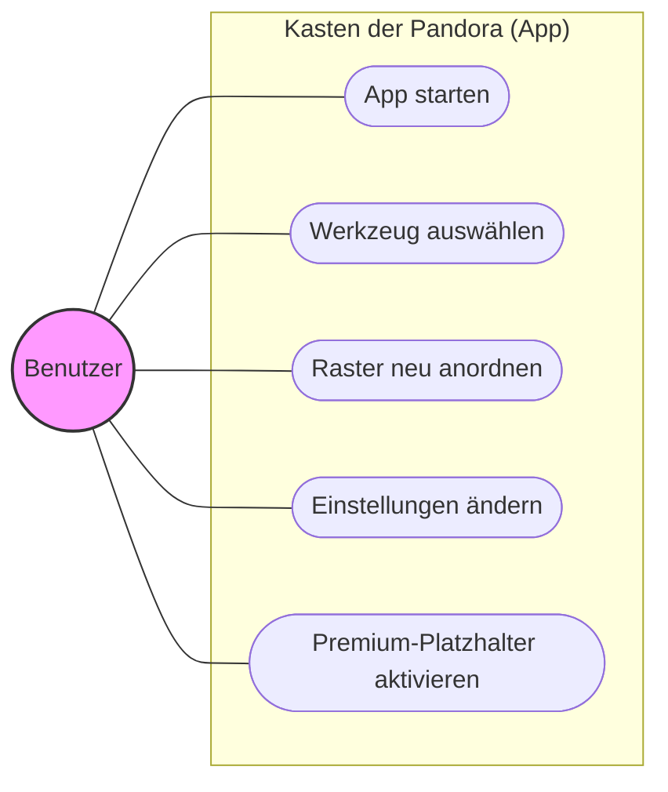

# Projektdokumentation: Kasten der Pandora

Diese Dokumentation bietet einen umfassenden Überblick über das Projekt **Kasten der Pandora**, einen modularen digitalen Werkzeugkasten für Android.

## 1. Projektübersicht

- **Projektname**: Kasten der Pandora
- **Thema**: Digitaler Werkzeugkasten gebündelt in einer zentralen Anwendung
- **Entwickler**: Matthias Reps, Johannes Lehmann
- **Technologie-Stack**: Android Studio, Kotlin
- **Kernkonzept**: Ein rasterbasierter Launcher (ähnlich einem Startbildschirm), über den Nutzer verschiedene Alltagswerkzeuge aufrufen und neu anordnen können.

## 2. Systemarchitektur

Die Anwendung folgt einem modularen **MVVM (Model-View-ViewModel)**-Muster und ist in einer mehrschichtigen Architektur aufgebaut, um Skalierbarkeit und eine saubere Trennung der Zuständigkeiten zu gewährleisten.

### 2.1 Schichtenstruktur

- **Präsentationsschicht**: Besteht aus Activities, Fragments und ViewModels.
- **Domänenschicht**: Enthält die Kernlogik für die einzelnen Werkzeuge.
- **Datenschicht**: Verwaltet Sensorzugriffe (z. B. Kamera, Mikrofon, GPS) und Systemdienste.
- **Plugin-Schnittstelle**: Ein vorbereiteter Platzhalter für zukünftige Erweiterbarkeit.

### 2.2 Klassendiagramm (Kernkomponenten)

Das folgende Diagramm veranschaulicht die Beziehung zwischen den Basisklassen und den spezifischen Werkzeug-Implementierungen.

## 3. Funktionen & Implementierung

### 3.1 Implementierte & geplante Werkzeuge

| **Werkzeug** | **Status** | **Implementierungsdetails** |
|---|---|---|
| **Zähler** | Implementiert | Einfaches Erhöhen/Verringern mit Doppeltipp zum Zurücksetzen. |
| **Uhr** | Implementiert | Fragment-basierte Benutzeroberfläche mit Tabs für Uhr, Wecker, Stoppuhr und Timer. |
| **Kompass** | Implementiert | Nutzt `ROTATION_VECTOR` oder Beschleunigungs-/Magnetsensoren mit Tiefpassfilterung für Stabilität. |
| **Dezibelmesser** | Implementiert | Echtzeit-Audioaufnahme über `AudioRecord` zur Berechnung von RMS/dB-Werten. |
| **Taschenrechner** | Geplant/Ref | Grundlegende Rechenfunktionen. |
| **Taschenlampe** | Geplant/Ref | SOS-Funktion enthalten. |

### 3.2 Wichtige technische Merkmale

- **Dynamisches Raster**: Verwendet `RecyclerView` mit `GridLayoutManager` und `ItemTouchHelper` für Drag-and-Drop-Neuanordnung der Werkzeuge.
- **Sensorintegration**: Zentralisierte Sensorverwaltung in der Datenschicht mit Berechtigungshandling für Kamera und Mikrofon.
- **Persistenz**: Werkzeuganordnungen werden über `SharedPreferences` oder `DataStore` gespeichert.

## 4. Benutzerinteraktion (Anwendungsfall)

Hauptaktionen:

- **App starten**: Öffnet die Hauptrasteransicht.
- **Werkzeug auswählen**: Durch Tippen auf ein Symbol wird die entsprechende `BaseToolActivity` geöffnet.
- **Raster neu anordnen**: Lange drücken und ziehen, um das Layout anzupassen.
- **Einstellungen**: Dunkelmodus, Schriftgröße und Sprache konfigurieren.

## 5. Entwicklungsprozess & Qualitätssicherung

KI wurde zur Unterstützung folgender Bereiche eingesetzt:

- Bilderstellung und -verbesserung.
- Code-Refactoring und Dokumentationshilfe.
- Recherche für UX/UI-Ideen und Werkzeugfunktionalitäten.